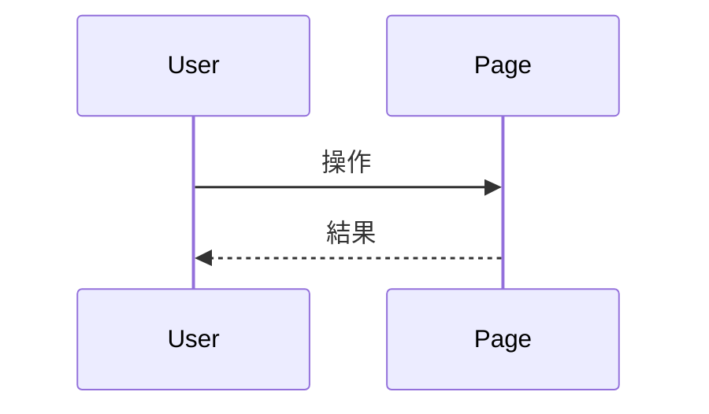

# 不具合の内容

## 再現手順
1.
2.
3.

## 期待結果

## 実際の結果

## 追加情報（環境など）
- OS/ブラウザ:
- スクリーンショット/ログ:

## 図や補足（Mermaid / PlantUML 可）

```mermaid
sequenceDiagram
  participant U as User
  participant P as Page
  U->>P: 操作
  P-->>U: 結果
```
