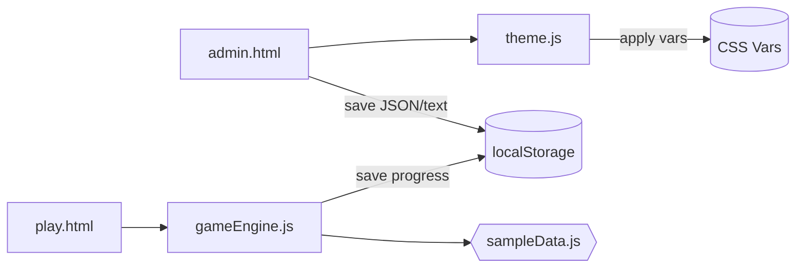
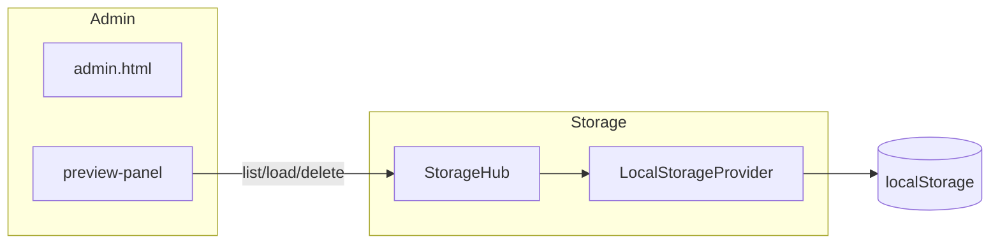

# AdventureGamePage
## ビジュアルノベル・アドベンチャーゲーム制作プラットフォーム

サーバー不要で動作する、アドベンチャーゲームの「管理（執筆）」と「プレイ」を行う静的Webページです。`index.html` をブラウザで開くだけで利用できます。

### 主な機能

#### 🎮 **プレイ機能** (`play.html`)
- **インタラクティブストーリー**: ノードベースの分岐型ストーリー
- **自動保存**: ノード遷移時の自動セーブ（設定で有効/無効切り替え）
- **履歴管理**: 戻る/進む機能で快適なナビゲーション
- **インベントリシステム**: アイテムの追加/削除/使用/消費
- **変数システム**: 数値/文字列/真偽値の汎用変数管理
- **画像表示**: ノードごとの背景画像設定
- **アクセシビリティ**: キーボードナビゲーション/ARIA属性/スクリーンリーダー対応
- **デバッグUI**: 🔧ボタンでリアルタイムデバッグ（開発時のみ）

#### ✏️ **管理機能** (`admin.html`)
- **Zenライク執筆**: 集中できる執筆環境
- **ノード編集**: ビジュアルノードエディタ
- **条件分岐**: アイテム/変数ベースの複雑な分岐設定
- **アクション設定**: アイテム操作/変数操作/効果設定
- **検証機能**: ゲームデータの整合性チェック
- **部分エクスポート**: 到達可能サブグラフの抽出
- **プレイテスト**: エディタ内で即座にテスト可能

#### 🧪 **テスト機能** (`test-rpg.html`)
- **サンプルゲーム**: 基本/RPG/複雑ストーリーのサンプル
- **自動テスト**: 各機能のテストスイート実行
- **リアルタイム監視**: ノード/変数/インベントリの状態表示
- **デバッグ操作**: UIから変数操作/ノードジャンプ可能

- 管理（`admin.html`）
  - Zen ライクな執筆画面（contenteditable）
  - 文字数カウント
  - 基本的な文字装飾（太字/斜体/下線、左右中央揃え）
  - 保存（シンプル＝プレーンテキスト、完全＝HTML+メタ）
  - 保存先の選択（IndexedDB/LocalStorage）と「保存一覧」（一覧・開く・エクスポート・削除）
  - JSON エクスポート/インポート
  - テーマ（背景/文字/アクセント色）プリセット＆カスタム
  - 保存プレビュー（一覧/読込/削除、選択削除・ラベル編集、フィルタ/ソート、設定でON）
  - 保存スナップショット（ラベル付きの複数スロット、設定でON）
  - ノード編集（MVP→UX強化）
    - 基本: 複数ノードを簡易編集（ID/タイトル/本文/選択肢）、`agp_game_data` 取込、検証、適用保存、JSON出力
    - 追加: 未保存バナー、開始ノードセレクタ、未解決 target 一覧（クリックで移動）、選択肢並べ替え（↑↓）、IDリネーム時の参照更新
    - 部分エクスポート: 選択ノードをseedに到達可能サブグラフを抽出して `game-spec.partial.json` を生成（meta.startは先頭seed）
- プレイ（`play.html`）
  - サンプルゲーム（内蔵 `scripts/sampleData.js`）で即プレイ可
  - 進行の保存/復帰、戻る・進む、リスタート
  - ゲームJSON読込（ヘッダーのボタンからインポート、`localStorage: agp_game_data`）
  - アクセシビリティ: 選択肢の自動フォーカス（最初のボタンに focus）

### 使い方（サーバー不要）
1. このディレクトリで `index.html` をブラウザで開きます（ダブルクリックでOK）。
2. 管理画面からゲームを作成・編集、プレイ画面で動作確認。
3. テスト画面でサンプルを試したり、自動テストを実行。

### クイックリンク
- 🏠 [トップページ](index.html) - プロジェクトの概要
- ✨ [**機能一覧**](features.html) - 実装済み機能を一覧で確認
- ✏️ [管理画面](admin.html) - ゲームの作成・編集
- 🎮 [プレイ画面](play.html) - ゲームのプレイテスト
- 📖 [学習ページ](learn.html) - サンプルとドキュメント
- 🧪 [テスト画面](tests/test.html) - 自動テスト実行

### クイックスタート
```bash
# 1. ブラウザで開く
open index.html

# 2. 機能一覧を確認
open features.html

# 3. RPGサンプルで機能を試す
open test-rpg.html

# 4. 自動テスト実行
# test-rpg.htmlの「🧪 テスト実行」ボタン
```

### ゲーム作成例
```javascript
// シンプルなゲームデータ
const myGame = {
  title: "マイゲーム",
  start: "start",
  nodes: {
    "start": {
      title: "スタート",
      text: "冒険の始まりです",
      image: "images/forest.jpg",
      choices: [
        {
          label: "森へ行く",
          target: "forest"
        }
      ],
      actions: [
        { type: "set_variable", key: "visited_start", value: true }
      ]
    },
    "forest": {
      title: "森",
      text: "深い森に到着しました",
      choices: [
        {
          label: "戻る",
          target: "start",
          conditions: [
            { type: "has_item", itemId: "key" }
          ]
        }
      ],
      actions: [
        { type: "add_item", itemId: "herb", quantity: 1 }
      ]
    }
  }
};
```

### キーボードショートカット（プレイ画面）
- ←（ArrowLeft）: 戻る
- →（ArrowRight）: 進む
- R: リスタート
- I/Z: インベントリ表示

### 設定
- `scripts/config.js` で各種設定変更可能
- `APP_CONFIG.debug.enabled = true` でデバッグUI有効化
- `APP_CONFIG.game.autoSave.enabled = true` で自動セーブ有効化

### テスト
- `test-rpg.html` で包括的テスト実行
- コンソールで詳細なテスト結果確認
- サンプルゲームの即時切り替え可能

## ディレクトリ構成
```
AdventureGamePage/
  index.html              # スタートページ
  admin.html              # 管理画面
  play.html               # プレイ画面
  test-rpg.html           # テスト画面
  styles/
    common.css
    admin.css
    play.css
  scripts/
    config.js             # 設定管理
    gameEngine.js         # ゲームエンジン
    nodeEditor.js         # ノードエディタ
    play.js               # プレイ画面制御
    debug.js              # デバッグUI
    tests.js              # テストスイート
    sample-game-*.js      # サンプルゲーム
  docs/
    guides/               # 作成ガイド
    issues/               # 機能開発履歴
```

## 技術仕様

### ゲームデータ構造
- **ノードベース**: シーン単位の分岐管理
- **条件分岐**: アイテム/変数ベースの動的分岐
- **アクション**: ノード到着時の自動実行処理
- **永続化**: localStorageによる自動保存

### 対応ブラウザ
- Chrome 80+
- Firefox 75+
- Safari 13+
- Edge 80+

### パフォーマンス
- 軽量設計（~50KB gzipped）
- メモリリーク対策済み
- サーバー不要でオフライン動作

## ディレクトリ構成
```
AdventureGamePage/
  index.html
  admin.html
  play.html
  styles/
    common.css
    admin.css
    play.css
  scripts/
    storage.js
    theme.js
    admin.js
    play.js
    gameEngine.js
    sampleData.js
    playImport.js
    storageProvider.js
    savePreview.js
  docs/
    architecture.md
    workflow.md
    issues.md
    test_plan.md
    design/
      storage-architecture.mmd
    specs/
      game-data-schema.md
  .vscode/
    extensions.json
    settings.json
  .github/
    ISSUE_TEMPLATE/
      feature.md
      bug.md
  .gitignore
```

## アーキテクチャ（概要）
- `scripts/storage.js`: localStorage の便利関数
- `scripts/theme.js`: テーマ（色）管理とパネル UI
- `scripts/admin.js`: 執筆エディタ（Zen ライク）と保存/読み込み
- `scripts/storageProvider.js`: StorageProvider 抽象化（LocalStorageProvider 実装と StorageHub を含む）
- `scripts/savePreview.js`: 保存プレビューのUIロジック（一覧/読込/削除、フラグで有効化）
- `scripts/gameEngine.js`: シンプルなノード/選択肢エンジン
- `scripts/play.js`: プレイ画面のエンジン駆動





## 推奨ツール/拡張と使い分け
- Mermaid（Windsurf/VSCodeでプレビュー可能）
  - アーキ図・分岐図のドラフトに最適。`docs/architecture.md` 参照。
- PlantUML（拡張: jebbs.plantuml）
  - 詳細シーケンス/クラス図などが必要なら併用。画像生成が必要な場合に。
- Kanban 管理（お好みで）
  - GitHub Projects のボード管理、または VSCode の Kanban 拡張（Kanbn / Vibe Kanban 等）
- ドキュメンテーション
  - まずは Markdown。将来的に API コメントが増えたら JSDoc + TypeDoc or Doxygen の導入を検討。
- Lint/Format
  - Prettier を使用（`.vscode/settings.json` で保存時フォーマット）。

## ワークフロー（概要）
- 管理（執筆）
  1. `admin.html` を開き、本文を執筆
  2. 文字装飾や整形はサイドバーのツールから
  3. 保存はシンプル/完全の2種（将来拡張を想定）
- プレイ
  1. `play.html` を開く
  2. 内蔵サンプルをプレイ（進行は自動保存）
  3. リスタートで最初から

詳細は `docs/workflow.md` を参照してください。

### 手動テスト（戻る機能）
1. `play.html` を開く
2. サンプルの選択肢で 2 ノード以上遷移
3. ヘッダーの「戻る」をクリックし、直前のノードへ戻ることを確認
4. リロード後も再度「戻る」で直前ノードに戻れることを確認（進行保存に履歴が含まれます）

### 手動テスト（進む機能）
1. `play.html` を開く
2. 2 ノード以上遷移 → 「戻る」で1手前へ
3. 「進む」をクリックし、元のノードへ進めることを確認
4. 通常遷移（選択肢クリック）を行うと「進む」が無効化されることを確認（フォワードスタックがクリアされます）

### キーボードショートカット（プレイ画面）

- ←（ArrowLeft）: 戻る（`goBack()`）
- →（ArrowRight）: 進む（`goForward()`）
- R: リスタート（`reset()`）

注: `APP_CONFIG.ui.shortcutsEnabled` が true の場合のみ有効。入力中（`input`/`textarea`/`contenteditable`）では無効化されます。

## 設定
- `scripts/config.js`
  - `APP_CONFIG.ui.showSavePreview`: 保存プレビュー機能の有効/無効（既定: false）
  - 有効化すると、管理画面右下の 🗂 ボタンで「保存プレビュー」パネルが開き、一覧・読込・削除が可能になります。
  - `APP_CONFIG.storage.backend`: `localStorage`（既定）/ `indexedDB`（実験的）
  - `APP_CONFIG.storage.keys`: 既定保存キー（`simple`/`full`）
  - `APP_CONFIG.storage.snapshots`: スナップショット設定
    - `enabled`: true で有効
    - `prefix`: スナップショットIDの接頭辞（既定: `agp_snap_`）

## ゲームデータJSONスキーマ（ドラフト）
仕様のドラフトは `docs/specs/game-data-schema.md` を参照してください。
管理側では以下をサポートしています。
- 「ゲームJSONエクスポート」: 現在のエディタ内容から最小構成のJSONを生成
- 「ゲームJSON再エクスポート（プレイ用）」: 現在 `agp_game_data`（または内蔵サンプル）をドラフト仕様に変換して書き出し
プレイ側では以下をサポートしています。
- 「ゲームJSON読込」: ドラフト仕様JSONを読み込み、エンジン形式に正規化して `agp_game_data` に保存（即リロード）

## 保存モードの違い（現状の仕様）
- シンプル保存
  - 本文のプレーンテキストのみを保存（`localStorage`）
  - 互換性が高く、容量も小さい
- 完全保存
  - 本文の HTML（装飾含む）とメタ情報（保存日時・テーマなど）を保存（`localStorage`）
  - 表示の再現性が高い

注意: `localStorage` にはブラウザ実装に依存しますが約 5MB 程度の制限があります。長文・画像などを扱う場合は将来の設計（IndexedDB / File System Access API など）に移行します。画像の保存は現状サポートしていません（`data:` での埋め込みは容量的に非推奨）。詳細は `docs/issues/05-save-architecture.md` を参照してください。

### 保存アーキテクチャの抽象化（新規）
- 保存先は `LocalStorage` と `IndexedDB` を「ストレージプロバイダ」として抽象化しています。
- 既定は IndexedDB（`scripts/config.js` の `storage.backend`）。サイドバーから切替可能。
- 「保存一覧」で保存内容を確認・開く・エクスポート・削除が可能です。
- 詳細: `docs/architecture-storage.md`

## アーキテクチャ（モジュラー設計）

### 概要
プロジェクトは保守性と拡張性を高めるため、大規模JavaScriptファイルをモジュラーなコンポーネントにリファクタリングしました。各ファイルは以下の3つのマネージャーに分割されています：

- **Utils**: 純粋なユーティリティ関数（計算、変換、ストレージ操作）
- **UIManager**: UIレンダリング、DOM操作、イベントハンドリング、アクセシビリティ対応
- **LogicManager**: コアビジネスロジック、状態管理、データ処理

### リファクタリングされたコンポーネント

#### 🎮 GameEngine (ゲームエンジン)
- **gameEngineUtils.js**: アイテムアイコン生成、アクション実行、エフェクト処理
- **gameEngineUIManager.js**: UIレンダリング、キーボードナビゲーション、アクセシビリティ
- **gameEngineLogicManager.js**: ゲーム状態管理、ナビゲーション、インベントリ管理
- **gameEngine.js**: マネージャー統合とAPI提供

#### ✏️ NodeEditor (ノードエディタ)
- **nodeEditorUtils.js**: ノード操作ユーティリティ、検証関数
- **nodeEditorUIManager.js**: UI状態管理、レンダリング、イベントバインディング
- **nodeEditorLogicManager.js**: ロード/保存/検証/エクスポートロジック
- **nodeEditor.js**: マネージャー統合とAPI提供

#### 📊 MermaidPreview (Mermaidプレビュー)
- **mermaidPreviewUtils.js**: グラフ処理、Mermaid生成ユーティリティ
- **mermaidPreviewUIManager.js**: UI状態管理、インタラクション処理
- **mermaidPreviewLogicManager.js**: グラフ構築、レンダリングロジック
- **mermaidPreview.js**: マネージャー統合とAPI提供

#### 🎨 Theme (テーマ管理)
- **themeUtils.js**: テーマ適用、プリセット管理、ストレージ操作
- **themeUIManager.js**: パネル構築、プレビュー更新、イベントハンドリング
- **themeLogicManager.js**: 初期化、テーマ適用、設定管理
- **theme.js**: マネージャー統合とAPI提供

#### ⚙️ AdminCore (管理コア)
- 複数のマネージャーモジュール（UI調整、API管理、ストレージ操作など）に分割済み
- **admin.core.js**: マネージャー統合と初期化

#### 💾 SavePreview (保存プレビュー)
- すでにクラスベースのモジュラー設計を実装済み

### 利点
- **保守性向上**: 各コンポーネントの責任が明確化
- **テスト容易性**: 個別コンポーネントのユニットテストが可能
- **拡張性**: 新機能追加時の影響範囲が局所化
- **再利用性**: ユーティリティ関数の共有化
- **開発効率**: 並行開発時の競合減少

### 開発時の注意点
- スクリプト読み込み順序を `admin.html` で確認してください
- 新規マネージャー追加時は、対応するUtils/UIManager/LogicManagerの3ファイルを検討
- イベント駆動型初期化（DOMContentLoaded）を維持してください

## Troubleshooting（ブラウザが開かない時）
環境により GUI アプリの自動起動が制限される場合があります。以下のいずれかの方法でご確認ください。
1. IDE のブラウザプレビューを使用する（推奨）
2. ローカル静的サーバーを起動してアクセス
   - `py -3 -m http.server 5500`
   - ブラウザで `http://127.0.0.1:5500/index.html` を開く
3. エクスプローラから `index.html` をダブルクリック

詳細は `docs/issues/02-browser-open-unstable.md` を参照。

## ライセンス
プロジェクト内のサンプルコード・文書はあなたのプロジェクト要件に合わせて自由に改変可能です。
