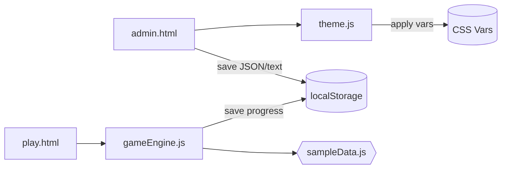
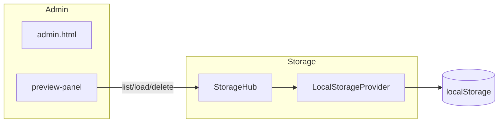

# AdventureGamePage
## ノード編集の使い方（MVP→UX強化）
1. 管理画面のサイドバー「ノード編集（MVP）」セクションから操作します。
2. 取込（agp_game_data）
   - すでに `play.html` で使用中のゲームJSON（`localStorage: agp_game_data`）を取り込みます。
   - ドラフト仕様またはエンジン形式いずれでも取り込み可能（自動変換）。
3. ノードの追加/削除/編集
   - ノード選択プルダウンで対象を選び、ID/タイトル/本文/選択肢（label/target）を編集。
   - 「ノード追加」「ノード削除」でCRUDが可能。
4. 検証
   - 「検証」ボタンで `scripts/validator.js` によるチェック（必須項目/重複ID/未解決target/到達不能/行き止まり）が行われ、結果は検証パネルに表示されます。
5. 適用保存
   - 「適用保存」でエンジン形式に正規化し `agp_game_data` に保存（プレイ画面に反映）。
6. JSON出力
   - 現在のドラフト仕様を `game-spec.json` としてダウンロードします。

7. 未保存と未解決の可視化
   - 変更があると未保存バナーが表示されます（Ctrl+S で保存）。
   - 未解決 target 一覧に未解決リンクが列挙され、クリックで該当ノードへ移動します。

8. ショートカット
   - Ctrl+S: 適用保存
   - Ctrl+Enter: ノード追加
   - Alt+Enter: 選択肢追加
   - Delete: ノード削除（確認あり）

9. 部分エクスポート
   - 複数ノードを選択し「選択からエクスポート」で到達サブグラフを `game-spec.partial.json` として保存（meta.start は選択先頭）。


サーバー不要で動作する、アドベンチャーゲームの「管理（執筆）」と「プレイ」を行う静的Webページです。`index.html` をブラウザで開くだけで利用できます。

- 管理（`admin.html`）
  - Zen ライクな執筆画面（contenteditable）
  - 文字数カウント
  - 基本的な文字装飾（太字/斜体/下線、左右中央揃え）
  - 保存（シンプル＝プレーンテキスト、完全＝HTML+メタ）
  - 保存先の選択（IndexedDB/LocalStorage）と「保存一覧」（一覧・開く・エクスポート・削除）
  - JSON エクスポート/インポート
  - テーマ（背景/文字/アクセント色）プリセット＆カスタム
  - 保存プレビュー（一覧/読込/削除、選択削除・ラベル編集、フィルタ/ソート、設定でON）
  - 保存スナップショット（ラベル付きの複数スロット、設定でON）
  - ノード編集（MVP→UX強化）
    - 基本: 複数ノードを簡易編集（ID/タイトル/本文/選択肢）、`agp_game_data` 取込、検証、適用保存、JSON出力
    - 追加: 未保存バナー、開始ノードセレクタ、未解決 target 一覧（クリックで移動）、選択肢並べ替え（↑↓）、IDリネーム時の参照更新
    - 部分エクスポート: 選択ノードをseedに到達可能サブグラフを抽出して `game-spec.partial.json` を生成（meta.startは先頭seed）
- プレイ（`play.html`）
  - サンプルゲーム（内蔵 `scripts/sampleData.js`）で即プレイ可
  - 進行の保存/復帰、戻る・進む、リスタート
  - ゲームJSON読込（ヘッダーのボタンからインポート、`localStorage: agp_game_data`）
  - アクセシビリティ: 選択肢の自動フォーカス（最初のボタンに focus）

### テスト用サンプルJSON
- `sample-game.json`: 未解決 target（missing-node）を1件含む動作確認用
- `sample-game-valid.json`: 警告・エラーのない正常データ
- `sample-game-unreachable.json`: 到達不能ノードの警告を含む

> 注: ゲームデータの分岐編集・相互変換（Mermaid など）は今後の Issue として拡張予定です。現状はライティング体験の MVP とプレイの MVP を用意しています。

## 使い方（サーバー不要）
1. このディレクトリで `index.html` をブラウザで開きます（ダブルクリックでOK）。
2. 管理画面から原稿を作成・保存、プレイ画面で動作確認。

## テスト（Mocha + Chai, ブラウザ実行）
1. ローカル静的サーバーを起動します。
   - `py -3 -m http.server 5500`
2. ブラウザで `http://127.0.0.1:5500/tests/test.html` を開きます。
3. 画面上で各テスト（Converters / Validator / StorageProvider / GameEngine）の結果を確認できます。
   - テストは `tests/*.spec.js` に実装されています。
   - 追加でユニットを拡張する場合は `scripts/` にPure関数を切り出し、`tests/` にスペックを追加してください。

## ディレクトリ構成
```
AdventureGamePage/
  index.html
  admin.html
  play.html
  styles/
    common.css
    admin.css
    play.css
  scripts/
    storage.js
    theme.js
    admin.js
    play.js
    gameEngine.js
    sampleData.js
    playImport.js
    storageProvider.js
    savePreview.js
  docs/
    architecture.md
    workflow.md
    issues.md
    test_plan.md
    design/
      storage-architecture.mmd
    specs/
      game-data-schema.md
  .vscode/
    extensions.json
    settings.json
  .github/
    ISSUE_TEMPLATE/
      feature.md
      bug.md
  .gitignore
```

## アーキテクチャ（概要）
- `scripts/storage.js`: localStorage の便利関数
- `scripts/theme.js`: テーマ（色）管理とパネル UI
- `scripts/admin.js`: 執筆エディタ（Zen ライク）と保存/読み込み
- `scripts/storageProvider.js`: StorageProvider 抽象化（LocalStorageProvider 実装と StorageHub を含む）
- `scripts/savePreview.js`: 保存プレビューのUIロジック（一覧/読込/削除、フラグで有効化）
- `scripts/gameEngine.js`: シンプルなノード/選択肢エンジン
- `scripts/play.js`: プレイ画面のエンジン駆動





## 推奨ツール/拡張と使い分け
- Mermaid（Windsurf/VSCodeでプレビュー可能）
  - アーキ図・分岐図のドラフトに最適。`docs/architecture.md` 参照。
- PlantUML（拡張: jebbs.plantuml）
  - 詳細シーケンス/クラス図などが必要なら併用。画像生成が必要な場合に。
- Kanban 管理（お好みで）
  - GitHub Projects のボード管理、または VSCode の Kanban 拡張（Kanbn / Vibe Kanban 等）
- ドキュメンテーション
  - まずは Markdown。将来的に API コメントが増えたら JSDoc + TypeDoc or Doxygen の導入を検討。
- Lint/Format
  - Prettier を使用（`.vscode/settings.json` で保存時フォーマット）。

## ワークフロー（概要）
- 管理（執筆）
  1. `admin.html` を開き、本文を執筆
  2. 文字装飾や整形はサイドバーのツールから
  3. 保存はシンプル/完全の2種（将来拡張を想定）
- プレイ
  1. `play.html` を開く
  2. 内蔵サンプルをプレイ（進行は自動保存）
  3. リスタートで最初から

詳細は `docs/workflow.md` を参照してください。

### 手動テスト（戻る機能）
1. `play.html` を開く
2. サンプルの選択肢で 2 ノード以上遷移
3. ヘッダーの「戻る」をクリックし、直前のノードへ戻ることを確認
4. リロード後も再度「戻る」で直前ノードに戻れることを確認（進行保存に履歴が含まれます）

### 手動テスト（進む機能）
1. `play.html` を開く
2. 2 ノード以上遷移 → 「戻る」で1手前へ
3. 「進む」をクリックし、元のノードへ進めることを確認
4. 通常遷移（選択肢クリック）を行うと「進む」が無効化されることを確認（フォワードスタックがクリアされます）

### キーボードショートカット（プレイ画面）

- ←（ArrowLeft）: 戻る（`goBack()`）
- →（ArrowRight）: 進む（`goForward()`）
- R: リスタート（`reset()`）

注: `APP_CONFIG.ui.shortcutsEnabled` が true の場合のみ有効。入力中（`input`/`textarea`/`contenteditable`）では無効化されます。

## 設定
- `scripts/config.js`
  - `APP_CONFIG.ui.showSavePreview`: 保存プレビュー機能の有効/無効（既定: false）
  - 有効化すると、管理画面右下の 🗂 ボタンで「保存プレビュー」パネルが開き、一覧・読込・削除が可能になります。
  - `APP_CONFIG.storage.backend`: `localStorage`（既定）/ `indexedDB`（実験的）
  - `APP_CONFIG.storage.keys`: 既定保存キー（`simple`/`full`）
  - `APP_CONFIG.storage.snapshots`: スナップショット設定
    - `enabled`: true で有効
    - `prefix`: スナップショットIDの接頭辞（既定: `agp_snap_`）

## ゲームデータJSONスキーマ（ドラフト）
仕様のドラフトは `docs/specs/game-data-schema.md` を参照してください。
管理側では以下をサポートしています。
- 「ゲームJSONエクスポート」: 現在のエディタ内容から最小構成のJSONを生成
- 「ゲームJSON再エクスポート（プレイ用）」: 現在 `agp_game_data`（または内蔵サンプル）をドラフト仕様に変換して書き出し
プレイ側では以下をサポートしています。
- 「ゲームJSON読込」: ドラフト仕様JSONを読み込み、エンジン形式に正規化して `agp_game_data` に保存（即リロード）

## 保存モードの違い（現状の仕様）
- シンプル保存
  - 本文のプレーンテキストのみを保存（`localStorage`）
  - 互換性が高く、容量も小さい
- 完全保存
  - 本文の HTML（装飾含む）とメタ情報（保存日時・テーマなど）を保存（`localStorage`）
  - 表示の再現性が高い

注意: `localStorage` にはブラウザ実装に依存しますが約 5MB 程度の制限があります。長文・画像などを扱う場合は将来の設計（IndexedDB / File System Access API など）に移行します。画像の保存は現状サポートしていません（`data:` での埋め込みは容量的に非推奨）。詳細は `docs/issues/05-save-architecture.md` を参照してください。

### 保存アーキテクチャの抽象化（新規）
- 保存先は `LocalStorage` と `IndexedDB` を「ストレージプロバイダ」として抽象化しています。
- 既定は IndexedDB（`scripts/config.js` の `storage.backend`）。サイドバーから切替可能。
- 「保存一覧」で保存内容を確認・開く・エクスポート・削除が可能です。
- 詳細: `docs/architecture-storage.md`

## Troubleshooting（ブラウザが開かない時）
環境により GUI アプリの自動起動が制限される場合があります。以下のいずれかの方法でご確認ください。
1. IDE のブラウザプレビューを使用する（推奨）
2. ローカル静的サーバーを起動してアクセス
   - `py -3 -m http.server 5500`
   - ブラウザで `http://127.0.0.1:5500/index.html` を開く
3. エクスプローラから `index.html` をダブルクリック

詳細は `docs/issues/02-browser-open-unstable.md` を参照。

## ライセンス
プロジェクト内のサンプルコード・文書はあなたのプロジェクト要件に合わせて自由に改変可能です。
