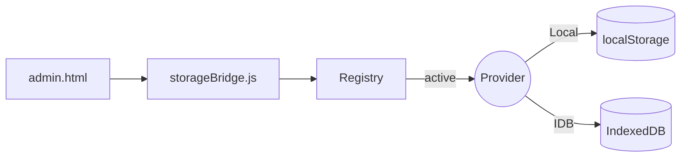

# Storage Architecture (Abstracted)

本ドキュメントは原稿保存のアーキテクチャを整理し、5MB 制限回避と拡張性を確保するための抽象化を示します。

## 概要
- LocalStorage と IndexedDB を「ストレージプロバイダ」として抽象化。
- UI から保存先を選択でき、将来は File System Access API やクラウドにも拡張可能。
- 既存のシンプル/完全保存は後方互換を維持しつつ、プロバイダにも保存します。

## 主要モジュール
- `scripts/storageProviders.js`
  - `LocalProvider`（localStorage）
  - `IDBProvider`（IndexedDB）
  - `Registry`（アクティブプロバイダの選択/取得）
- `scripts/storageBridge.js`
  - Admin UI からアクティブプロバイダへ操作を橋渡し
  - `saveSimple() / loadSimple()`、`saveFull() / loadFull()` など
- `scripts/admin.js`
  - 互換ルート（localStorage）と Bridge ルートを切替
  - 保存一覧 UI（一覧・開く・エクスポート・削除）

## データモデル（MVP）
- `type: 'manuscript'`
- `kind: 'simple' | 'full'`
- `title: string`
- `text?: string`（simple）
- `html?: string`（full）
- `meta: { savedAt: ISOString, theme?: object, provider?: string }`

## フロー（Mermaid）

## 選定理由と方針
- IndexedDB を優先（大きめのデータに強く、JSON/BLOBを扱える）
- LocalStorage は後方互換と超軽量用途に残す
- 将来拡張: `FileSystemAccessProvider`, `GistProvider` 等の追加で柔軟に拡張

## UI
- `admin.html` サイドバー
  - 保存先選択（IndexedDB/LocalStorage）
  - 「保存一覧」ボタンで一覧パネルを表示
- 一覧パネル内容
  - `title` / `savedAt` / `provider` / `size` / `textPreview`
  - 開く / エクスポート / 削除

## 既知の制約
- IndexedDB はブラウザ/環境差異によりクォータが異なる
- エクスポートは JSON ファイル（添付やバックアップ用途を想定）

## 今後
- BLOB（画像/音声）対応: IndexedDB に BLOB を格納、または File System Access API 連携
- スナップショット機能の本実装（現状はモックパネルのみ）
- 保存一覧の検索/タグ/フィルタ
