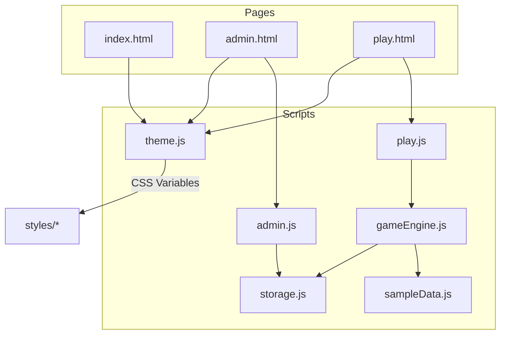

# Architecture

本プロジェクトはサーバー不要の静的サイト構成で、`localStorage` を用いた保存を前提とした最小構成の MVP です。将来は機能拡張（分岐エディタ、Wiki、縦書き等）に対応できるよう、モジュールの責務を分離しています。

## Component Diagram (Mermaid)

## 将来の拡張ポイント
- 分岐データのモデル化（Graph）と編集 UI
- Mermaid/PlantUML との相互変換（テキスト⇄ノード）
- プロパティ（キャラクター・所持品・組織）
- Wiki 機能（AI 補助、オフ可能な実験フラグ）
- 縦書き表示と高度なタイポグラフィ

## 設計ポリシー
- 単一責任、関心の分離（SRP, SoC）
- DRY / KISS / YAGNI
- 将来の拡張に対して Open、既存には Closed（OCP）
