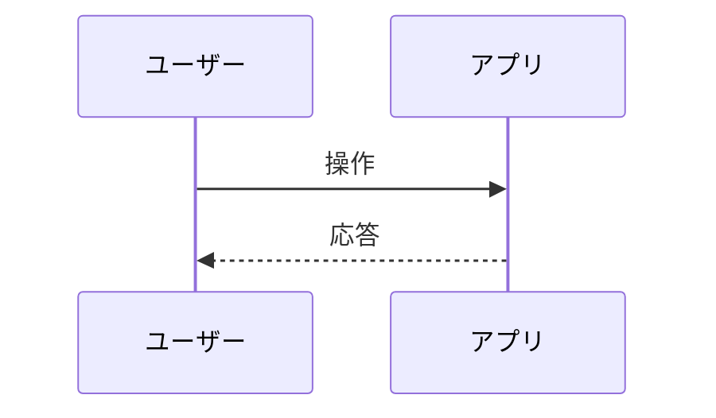

# Issue Workflow 設計

このプロジェクトにおける Issue の伝え方・管理方法を定義します。GitHub Issues を前提としつつ、ローカルのみで運用する場合は `docs/issues/*.md` を併用します。

## 起票時の基本フォーマット
- タイトル: 簡潔に（例: 「空のエディタで文字数が1になる」）
- ラベル: `bug` | `feature` | `enhancement` | `design` | `ops` など
- 概要: 問題/目的を1-2文で
- 背景/根拠: なぜ必要か
- 要件/受け入れ条件 (Acceptance Criteria): チェックボックス形式
- 再現手順（バグの場合）
- 期待動作
- 添付: スクリーンショット、ログ、図（Mermaid/PlantUML）
- 影響範囲/リスク
- テスト: 手順・観点

## 図の添付（Mermaid 推奨）

## Kanban 運用（推奨）
- ボード列: `Backlog` → `Todo` → `In Progress` → `Review` → `Done`
- 1 Issue = 1 目的。大きいものは Epic/親Issueに分割
- 進捗更新は小さく頻繁に。コミットに `#<issue_number>` を含めてリンク

## 優先度の目安
- high: 欠陥/体験に大きく影響。次イテレーションの対象
- medium: 改善効果が見込める。計画的に
- low: 将来検討

## ユーザーからの伝え方
- 可能であれば以下を添えてください
  - 期待動作と実際の動作の差分
  - 再現手順（操作列挙）
  - エラーメッセージ/スクショ
  - どのページ/要素か（例: `admin.html` のエディタ）

## レビュー/クローズ基準
- 受け入れ条件を満たすか
- `docs/test_plan.md` にテストが追記/更新されているか
- ドキュメント/図が更新されているか（該当時）

## ローカル運用（GitHub未使用のとき）
- `docs/issues/` 以下に 2桁の番号+スラッグでMarkdownを作成
- 進捗はファイル先頭に `status: open|in_progress|review|done` を追記
- Kanbanが必要なら VSCode拡張（Kanbn / Vibe Kanban）を使用
