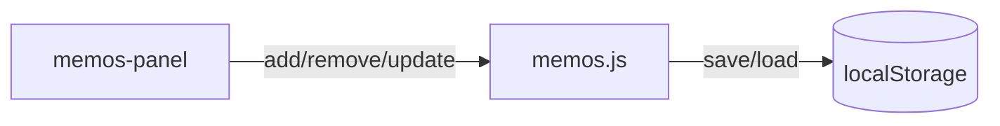

# Issue: 付箋メモ機能（MVP）

- 種別: feature
- 優先度: medium
- 画面: `admin.html`

## 要件
- ページ内に付箋メモパネルを開き、メモを追加・一覧・削除できる
- メモにはラベル、本文、作成日時、順位（ユーザー定義）を保持
- 並べ替え: 作成日時（昇順/降順）、順位（昇順/降順）
- UI: フローティングのクイックボタンから開閉可能

## 現状（MVP実装済）
- `scripts/memos.js` による localStorage 保存（キー: `agp_memos`）
- 追加・一覧・削除・順位編集・並べ替えが可能
- `config.js` の `ui.showMemos` で機能の初期有効化

## 図（Mermaid）

## 次の拡張
- メモにタグ・色・リンクを追加
- エディタ選択範囲→メモ化（引用）
- Export/Import と同梱、または独立JSONでの入出力
