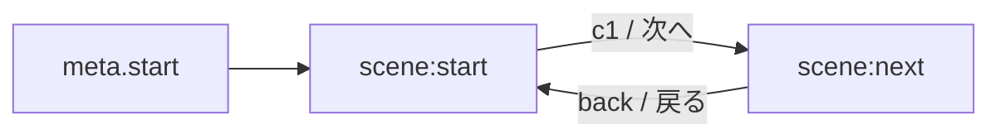

# Game Data JSON Schema (Draft)

目的: 管理画面で作成したコンテンツをプレイ画面で解釈できる、最小限の分岐ゲームデータ形式を定義する。

## 1. 基本構造

```json
{
  "version": "1.0",
  "meta": {
    "title": "サンプルタイトル",
    "author": "you",
    "createdAt": "2025-09-25T04:00:00.000Z",
    "updatedAt": "2025-09-25T04:00:00.000Z",
    "start": "scene:start"
  },
  "nodes": [
    {
      "id": "scene:start",
      "title": "はじまり",
      "text": "テキスト本文…",
      "choices": [{ "id": "c1", "label": "次へ", "target": "scene:next" }]
    },
    {
      "id": "scene:next",
      "title": "つづき",
      "text": "テキスト本文…",
      "choices": [{ "id": "back", "label": "戻る", "target": "scene:start" }]
    }
  ]
}
```

- `meta.start`: 最初に表示するノードID
- `nodes[*].text`: プレーンテキスト。将来、マークアップや装飾を拡張可能
- `nodes[*].actions`: ノード到達時に実行されるアクション配列（インベントリ操作/変数操作/オーディオ制御など）
- `choices[*]`: 分岐先を指す。任意で `conditions` や `effects` を付与可能

## 2. ドメイン拡張（所持品・キャラクター・Wiki）

ゲーム内で参照頻度の高い情報を一元管理するため、以下のモジュールを追加します。

```json
{
  "items": [
    {
      "id": "item:sword",
      "name": "古代の剣",
      "description": "伝説の勇者が使ったとされる剣",
      "tags": ["武器", "遺物"],
      "effects": ["attack+2"]
    }
  ],
  "characters": [
    {
      "id": "char:mentor",
      "name": "導師セレス",
      "roles": ["ガイド"],
      "summary": "主人公を導く老賢者。",
      "relationships": [{ "target": "char:hero", "type": "mentor" }]
    }
  ],
  "lore": {
    "entries": [
      {
        "id": "lore:ancient-ruin",
        "title": "古代遺跡",
        "body": "かつて栄えた文明の中心地。",
        "relatedNodes": ["scene:start"],
        "tags": ["地名", "歴史"],
        "summary": "古代文明が眠る遺跡。",
        "sources": ["char:mentor"]
      }
    ]
  }
}
```

## 3. プレイヤー状態とセーブデータ

- `state.inventory`: 所持品のID配列（`items[*].id`と対応）
- `state.flags`: 条件分岐に用いるフラグ辞書（`{ "metMentor": true }` など）
- `state.variables`: 数値/文字列の汎用ステータス
- `state.history`: 訪問ノード履歴。Wiki自動解放や回想参照に利用

```json
{
  "state": {
    "inventory": ["item:sword"],
    "flags": { "metMentor": true },
    "variables": { "reputation": 12 },
    "history": ["scene:start", "scene:intro"]
  }
}
```

## 4. JSON Schema（拡張版）

（バリデーション用ラフ案）

```json
{
  "$schema": "https://json-schema.org/draft/2020-12/schema",
  "$id": "https://example.com/schemas/agp-game-data.schema.json",
  "type": "object",
  "required": ["version", "meta", "nodes"],
  "properties": {
    "version": { "type": "string" },
    "meta": {
      "type": "object",
      "required": ["title", "start"],
      "properties": {
        "title": { "type": "string" },
        "author": { "type": "string" },
        "createdAt": { "type": "string" },
        "updatedAt": { "type": "string" },
        "start": { "type": "string" }
      }
    },
    "nodes": {
      "type": "array",
      "items": {
        "type": "object",
        "required": ["id", "text"],
        "properties": {
          "id": { "type": "string" },
          "title": { "type": "string" },
          "text": { "type": "string" },
          "image": { "type": "string" },
          "choices": {
            "type": "array",
            "items": {
              "type": "object",
              "required": ["label", "target"],
              "properties": {
                "id": { "type": "string" },
                "label": { "type": "string" },
                "target": { "type": "string" },
                "conditions": { "type": "array" },
                "effects": { "type": "array" }
              }
            }
          },
          "actions": {
            "type": "array",
            "items": { "type": "object" }
          }
        }
      }
    },
    "items": {
      "type": "array",
      "items": {
        "type": "object",
        "required": ["id", "name"],
        "properties": {
          "id": { "type": "string" },
          "name": { "type": "string" },
          "description": { "type": "string" },
          "tags": { "type": "array", "items": { "type": "string" } },
          "effects": { "type": "array", "items": { "type": "string" } }
        }
      }
    },
    "characters": {
      "type": "array",
      "items": {
        "type": "object",
        "required": ["id", "name"],
        "properties": {
          "id": { "type": "string" },
          "name": { "type": "string" },
          "roles": { "type": "array", "items": { "type": "string" } },
          "summary": { "type": "string" },
          "relationships": {
            "type": "array",
            "items": {
              "type": "object",
              "required": ["target", "type"],
              "properties": {
                "target": { "type": "string" },
                "type": { "type": "string" }
              }
            }
          }
        }
      }
    },
    "lore": {
      "type": "object",
      "properties": {
        "entries": {
          "type": "array",
          "items": {
            "type": "object",
            "required": ["id", "title", "body"],
            "properties": {
              "id": { "type": "string" },
              "title": { "type": "string" },
              "body": { "type": "string" },
              "summary": { "type": "string" },
              "tags": { "type": "array", "items": { "type": "string" } },
              "relatedNodes": { "type": "array", "items": { "type": "string" } },
              "sources": { "type": "array", "items": { "type": "string" } }
            }
          }
        }
      }
    },
    "state": {
      "type": "object",
      "properties": {
        "inventory": { "type": "array", "items": { "type": "string" } },
        "flags": {
          "type": "object",
          "additionalProperties": { "type": ["boolean", "number", "string"] }
        },
        "variables": { "type": "object", "additionalProperties": { "type": ["number", "string"] } },
        "history": { "type": "array", "items": { "type": "string" } }
      }
    }
  }
}
```

## 5. フロー（Mermaid）



## 6. 実装メモ

- `scripts/play.js` は既存の `sampleData.js` を読む設計。今後、`game-data-schema` に準拠したJSONをインポートできるよう拡張する。
- 保存はローカル（localStorage/IndexedDB）。プレビューやスナップショットは `StorageProvider`/`StorageBridge` を共通利用。

## 7. サンプルデータ

拡張スキーマに対応したサンプルデータは `samples/` 配下に配置されています。`scripts/generate-samples.js` を実行して生成してください。

- `samples/items.json`: アイテム（武器、消耗品）の例
- `samples/characters.json`: キャラクター（プレイヤー、NPC）の例
- `samples/lore.json`: Wikiエントリの例
- `samples/state.json`: プレイヤー状態（所持品、フラグ、変数、履歴）の例

## 8. データマイグレーション

既存のレガシーデータ（`agp_manuscript_full`）を新しい拡張スキーマに移行する `scripts/dataMigration.js` が用意されています。ページ読み込み時に自動実行され、古いデータをアイテム・キャラクター・Wiki・状態に変換します。

### マイグレーションウィザード

`scripts/migrationWizard.js` はユーザーが制御できる移行インターフェースを提供します。古いデータが存在する場合、ページ読み込み時にモーダルウィザードが表示され、以下の機能を提供します：

- **データプレビュー**: 移行されるデータの種類と件数を事前に確認
- **手動実行**: ユーザーが移行タイミングを制御
- **進捗フィードバック**: 移行完了/失敗の通知

### 移行処理の詳細

1. テキスト解析によりアイテム・キャラクター・Wikiを自動抽出
2. 既存の履歴データを新しい状態モデルに移行
3. 移行フラグを付与（再実行防止）
