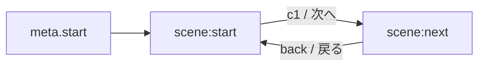

# Game Data JSON Schema (Draft)

目的: 管理画面で作成したコンテンツをプレイ画面で解釈できる、最小限の分岐ゲームデータ形式を定義する。

## 1. 基本構造
```json
{
  "version": "1.0",
  "meta": {
    "title": "サンプルタイトル",
    "author": "you",
    "createdAt": "2025-09-25T04:00:00.000Z",
    "updatedAt": "2025-09-25T04:00:00.000Z",
    "start": "scene:start"
  },
  "nodes": [
    {
      "id": "scene:start",
      "title": "はじまり",
      "text": "テキスト本文…",
      "choices": [
        { "id": "c1", "label": "次へ", "target": "scene:next" }
      ]
    },
    {
      "id": "scene:next",
      "title": "つづき",
      "text": "テキスト本文…",
      "choices": [
        { "id": "back", "label": "戻る", "target": "scene:start" }
      ]
    }
  ]
}
```

- `meta.start`: 最初に表示するノードID
- `nodes[*].text`: プレーンテキスト。将来、マークアップや装飾を拡張可能
- `choices[*]`: 分岐先を指す。将来 `conditions` や `effects` を導入

## 2. 追加要素（将来拡張の提案）
- `nodes[*].image`: 画像URL（大容量対応はIndexedDB/FS APIで）
- `choices[*].conditions`: 所持フラグや履歴に応じた分岐条件
- `choices[*].effects`: 選択時にセットするフラグやカウンタの更新
- `variables`: ゲーム全体の汎用フラグ/カウンタ

## 3. JSON Schema（最小版）
（バリデーション用ラフ案）
```json
{
  "$schema": "https://json-schema.org/draft/2020-12/schema",
  "$id": "https://example.com/schemas/agp-game-data.schema.json",
  "type": "object",
  "required": ["version", "meta", "nodes"],
  "properties": {
    "version": { "type": "string" },
    "meta": {
      "type": "object",
      "required": ["title", "start"],
      "properties": {
        "title": { "type": "string" },
        "author": { "type": "string" },
        "createdAt": { "type": "string" },
        "updatedAt": { "type": "string" },
        "start": { "type": "string" }
      }
    },
    "nodes": {
      "type": "array",
      "items": {
        "type": "object",
        "required": ["id", "text"],
        "properties": {
          "id": { "type": "string" },
          "title": { "type": "string" },
          "text": { "type": "string" },
          "image": { "type": "string" },
          "choices": {
            "type": "array",
            "items": {
              "type": "object",
              "required": ["label", "target"],
              "properties": {
                "id": { "type": "string" },
                "label": { "type": "string" },
                "target": { "type": "string" },
                "conditions": { "type": "array" },
                "effects": { "type": "array" }
              }
            }
          }
        }
      }
    }
  }
}
```

## 4. フロー（Mermaid）


## 5. 実装メモ
- `scripts/play.js` は既存の `sampleData.js` を読む設計。今後、`game-data-schema` に準拠したJSONをインポートできるよう拡張する。
- 保存はローカル（localStorage/IndexedDB）。プレビューやスナップショットは `StorageProvider`/`StorageBridge` を共通利用。
